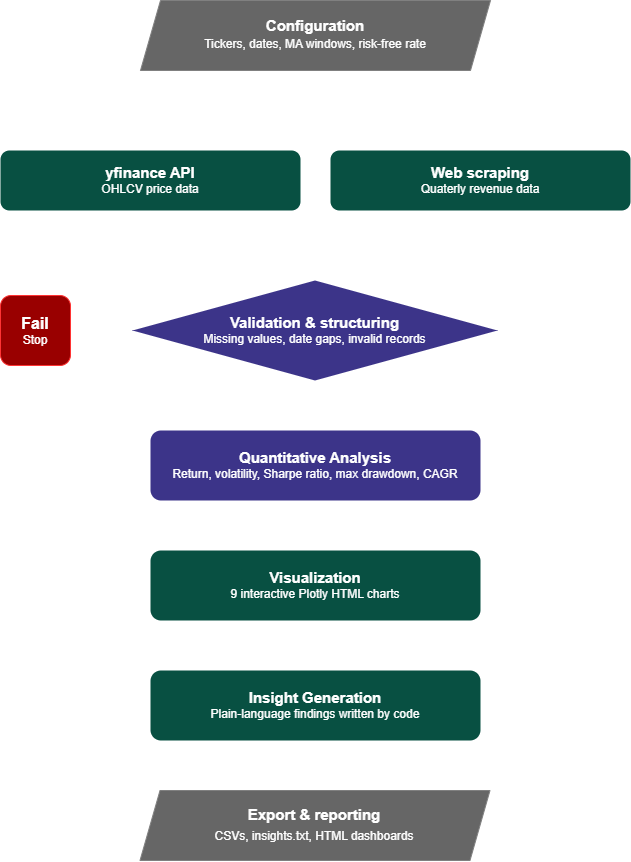

# End-to-End Stock Market Analytics Dashboard

A fully automated analytics pipeline that transforms raw market data into interactive financial insights. Built in Python using yfinance, Pandas, and Plotly.

  

**[Portfolio](https://derrickscottux-collab.github.io/) · [LinkedIn](https://www.linkedin.com/in/derrick-scott-980109236/) · [Presentation](presentation/Stock_Analytics_Pipeline.pdf)**

---

## Overview

This project started as an IBM Data Analytics guided notebook covering basic stock visualization for Tesla and GameStop. It evolved into a complete analytics pipeline with modular architecture, a validation system, five financial metrics, nine interactive visualizations, benchmark comparison, automated insight generation, and a full export system.

The key design principle: **nothing is hardcoded**. Change the tickers or date range in the config and every chart, metric, and insight regenerates automatically from scratch.

The intended audience for this analysis includes hiring managers, technical leaders, and anyone evaluating data analytics or financial reporting skill sets. Findings are structured to demonstrate an end-to-end analytics workflow, from raw data extraction through to stakeholder-ready visualizations.

---

## Business Question

**How have major tech and consumer stocks performed against the broader market, and what does that performance reveal about risk and opportunity?**

This project examines performance, risk, and benchmark comparison across:

- Individual stock returns and volatility
- Risk-adjusted performance (Sharpe Ratio, Max Drawdown)
- Correlation between holdings
- Performance relative to the S&P 500

---

## Why This Matters

Understanding risk-adjusted return and benchmark comparison is core to investment decision-making.

This analysis helps stakeholders:

- Identify which holdings generated the strongest returns and at what risk
- Understand diversification benefits across uncorrelated assets
- Spot periods of macro-driven, market-wide risk
- Compare individual stock performance against a market benchmark
- Support data-driven portfolio and investment decisions

---

## Pipeline Architecture



```text
Configuration → Data Extraction → Validation & Structuring
     → Quantitative Analysis
     → Visualization
     → Insight Generation
     → Export & Reporting
```

Each stage has a clear input and output. Nothing downstream runs without the stage before it completing cleanly.

---

## Features

- **Centralized config layer** — tickers, date range, colors, moving average windows, and risk-free rate all live in one dictionary
- **Dual data extraction** — yfinance API for OHLCV price data, BeautifulSoup web scraping for quarterly revenue
- **Caching system** — downloaded data is stored locally so repeated runs don't re-fetch
- **Validation & structuring** — checks for missing values, date gaps, and invalid records before any analysis runs
- **5 financial metrics** — Total Return, Annualized Volatility, Sharpe Ratio, Max Drawdown, CAGR
- **9 interactive visualizations** — all exported as standalone HTML (no Python required to view)
- **Automated insight generation** — plain-language findings written by code, not manually typed
- **Full export system** — CSVs, insights text file, and HTML dashboards

---

## Visualizations

| File | Chart |
|------|-------|
| `01_normalized_performance.html` | Normalized price performance (base = 100) vs S&P 500 |
| `02_revenue_vs_price_TSLA.html` | Tesla quarterly revenue vs stock price |
| `02_revenue_vs_price_GME.html` | GameStop quarterly revenue vs stock price |
| `03_price_volume_ma_TSLA.html` | Tesla price, 50/200-day MAs, volume, golden/death crosses |
| `03_price_volume_ma_GME.html` | GameStop price, 50/200-day MAs, volume, golden/death crosses |
| `04_correlation_heatmap.html` | Pearson correlation matrix of daily returns |
| `05_returns_distribution.html` | Daily return distributions with KDE curves |
| `06_monthly_heatmap.html` | Monthly return heatmap by stock and year |
| `07_alpha_vs_benchmark.html` | Rolling 1-year alpha vs S&P 500 benchmark |

---

## Stocks Analyzed

| Ticker | Company | Period |
|--------|---------|--------|
| TSLA | Tesla | Jan 2019 – present |
| GME | GameStop | Jan 2019 – present |
| AAPL | Apple | Jan 2019 – present |
| MSFT | Microsoft | Jan 2019 – present |
| ^GSPC | S&P 500 (benchmark) | Jan 2019 – present |

---

## Business Questions Answered

- Which stocks generated the strongest returns over the analysis period?
- How did risk-adjusted performance compare across assets?
- Which investments demonstrated the most consistent growth?
- How would a diversified portfolio have performed versus individual holdings?
- What insights can investors use to support future decisions?

## Key Findings

- **Tesla** delivered the highest total return at +1,878%, roughly 10x the S&P 500 over the same period
- **GameStop** peaked at 2,749x its starting value during the January 2021 short squeeze, generating a +1,625% monthly return before giving back most of those gains
- **Apple** had the best risk-adjusted performance with a Sharpe Ratio of 1.01, outperforming Tesla on a return-per-unit-of-risk basis
- **GameStop's** correlation with every other stock in the group was essentially noise (0.12–0.17), driven by retail sentiment rather than market-wide factors
- **2022** is the clearest macro signal in the data — January through June was broadly red across all four stocks as the Fed began its most aggressive rate hiking cycle in decades

---

## Project Structure

```text
stock-analytics-pipeline/
│
├── Stock_Analysis_Dashboard_Portfolio.ipynb   # Main notebook
│
├── figures/                                   # Interactive HTML charts
│   ├── 01_normalized_performance.html
│   ├── 02_revenue_vs_price_TSLA.html
│   ├── 02_revenue_vs_price_GME.html
│   ├── 03_price_volume_ma_TSLA.html
│   ├── 03_price_volume_ma_GME.html
│   ├── 04_correlation_heatmap.html
│   ├── 05_returns_distribution.html
│   ├── 06_monthly_heatmap.html
│   └── 07_alpha_vs_benchmark.html
│
├── exports/                                   # Data exports
│   ├── metrics_summary.csv
│   ├── all_close_prices.csv
│   ├── insights.txt
│   ├── TSLA_revenue_data.csv
│   └── GME_revenue_data.csv
│
├── images/                                    # Pipeline diagram
│   └── pipeline-diagram.png
│
├── presentation/
│   └── Stock_Analytics_Pipeline.pdf
│
├── data/                                      # Cached price data (git-ignored)
│
├── requirements.txt
├── .gitignore
└── README.md
```

---

## Data Collection Methods

| Method | Purpose | Output |
|----------|----------|----------|
| yfinance API | Pull OHLCV price and volume history for each ticker | Cached price datasets |
| Web Scraping | Collect quarterly revenue data for Tesla and GameStop | Revenue comparison datasets |

---

## Technologies Used

### Data Analysis

- Python
- Pandas
- NumPy
- SciPy

### Data Collection

- yfinance
- Requests
- BeautifulSoup

### Visualization & Reporting

- Plotly
- Matplotlib
- Seaborn
- Jupyter Notebook

---

## Getting Started

### Install dependencies

```bash
pip install -r requirements.txt
```

### Run

1. Clone the repo
   ```bash
   git clone https://github.com/derrickscottux-collab/stock-analytics-pipeline.git
   ```
2. Open `Stock_Analysis_Dashboard_Portfolio.ipynb` in Jupyter or VS Code
3. Optionally edit the `CONFIG` dictionary at the top to change tickers or date range
4. Run all cells — **Kernel → Restart & Run All**

All charts, metrics, exports, and insights will regenerate automatically.

### Changing the Tickers

Edit the `CONFIG` block at the top of the notebook:

```python
CONFIG = {
    "tickers": ["AAPL", "GOOGL", "AMZN", "META"],
    "ticker_names": {
        "AAPL": "Apple",
        "GOOGL": "Google",
        "AMZN": "Amazon",
        "META": "Meta"
    },
    "start_date": "2020-01-01",
    ...
}
```

Everything downstream updates automatically.

---

## Project Deliverables

- End-to-end analysis notebook
- Modular financial metrics engine
- Nine interactive Plotly visualizations
- Benchmark comparison against the S&P 500
- Automated insight generation
- Full CSV and HTML export pipeline
- Executive-style presentation walking through the pipeline and key findings

---

## Dependencies

```
yfinance
pandas
numpy
plotly
matplotlib
seaborn
scipy
requests
beautifulsoup4
nbformat
```

---

## Data Sources

- **Price & volume data**: [yfinance](https://github.com/ranaroussi/yfinance) (Yahoo Finance API)
- **Revenue data**: IBM Skills Network static course archive (web scraped via BeautifulSoup) — covers Tesla through Q3 2022, GameStop through Q1 2020

---

## Origin

Expanded from the IBM Data Analytics Professional Certificate capstone notebook. The original covered basic revenue and price visualization for two stocks. This version adds modular architecture, a validation system, four additional stocks, a full financial metrics engine, benchmark comparison, nine visualizations, automated insight generation, and a complete export pipeline.

---

## Author

**Derrick Scott**

[Portfolio](https://derrickscottux-collab.github.io/)
| [LinkedIn](https://www.linkedin.com/in/derrick-scott-980109236/)
| [GitHub](https://github.com/derrickscottux-collab)

---

## License

This repository does not currently have a formal license. If you would like to use or adapt this project, please reach out via [LinkedIn](https://www.linkedin.com/in/derrick-scott-980109236/).
